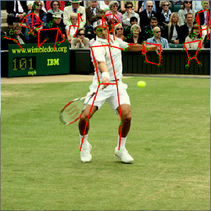

# PoseNet-Unity

[PoseNet](https://github.com/tensorflow/tfjs-models/tree/master/posenet) Based Unity Project

## Environment

* Unity 2018.1
* DotNet 4.6

## Installation

* Using TensorFlowSharp 1.7
  * [Using TensorFlowSharp in Unity (Experimental)](https://github.com/Unity-Technologies/ml-agents/blob/develop/docs/Using-TensorFlow-Sharp-in-Unity.md)

  * Get: https://s3.amazonaws.com/unity-ml-agents/0.4/TFSharpPlugin.unitypackage

## Dependencies

* [ml-agents](https://github.com/Unity-Technologies/ml-agents/)

# Blogs

* [PoseNetをマルチプラットフォームで実装してみた](https://qiita.com/otmb/items/561a62d3413295cc744e)

## Development By Infocom TPO

[Infocom TPO](https://lab.infocom.co.jp/)

## License

PoseNet-Unity is available under the MIT license. See the LICENSE file for more info.